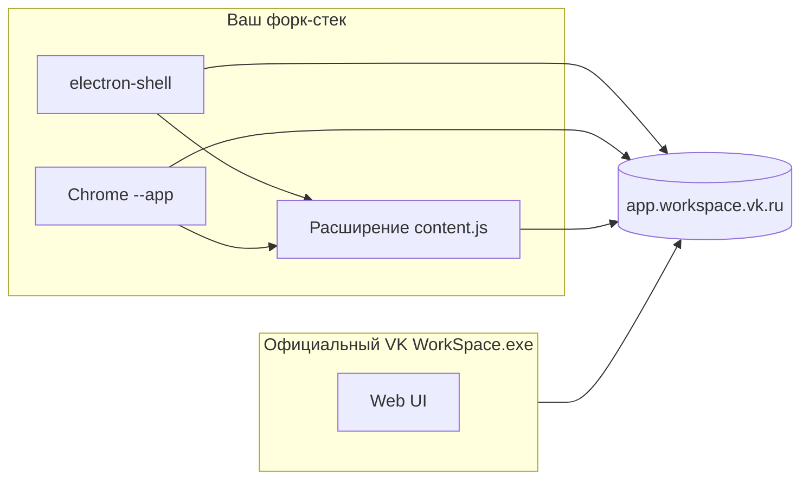

# Как сделать «форк» под свою фичу

## Что можно форкать, а что нет

| Объект | Форк возможен? |
|--------|----------------|
| Официальный **VK WorkSpace.exe** | **Нет** — закрытый код, нет публичного репозитория |
| **Это расширение** (ваш репозиторий) | **Да** — fork на GitHub, свои ветки |
| **Свой десктоп-клиент** (Electron) | **Да** — папка `electron-shell/` |
| **Запуск Chrome как приложения** | **Да** — `scripts/launch-workspace-app.ps1` |

«Форк приложения VK» на практике = **своя оболочка** + **ваше расширение**, а не копирование их `.exe`.

---

## Путь 1 — Fork расширения (GitHub)

1. Fork репозитория с расширением на GitHub.
2. Клонируйте **свой** fork:
   ```bash
   git clone https://github.com/YOUR_USER/vk-teams-custom.git
   ```
3. Ветка, правки в `content.js`, `manifest.json`, релиз.
4. Установка: `chrome://extensions` → «Загрузить распакованное».

Это форк **кода фичи**, не десктопа VK.

---

## Путь 2 — Свой десктоп (Electron) — рекомендуется для «своего приложения»

Уже в репозитории:

```bash
cd electron-shell
npm install
npm start
```

Что происходит:

```
electron-shell/main.js
    → session.extensions.loadExtension(../)
    → окно BrowserWindow → app.workspace.vk.ru
    → content.js внедряет кнопки реакций
```

В `content.js` для shell отключена проверка «активации» в попапе (маркер `VKTeamsCustomShell` в User-Agent).

### Собрать .exe для коллег

1. В `electron-shell`: `npm install --save-dev electron-builder`
2. Настроить `build` в `package.json` (иконка, `appId`, имя).
3. `npm run dist` → установщик в `dist/`.

Коллеги ставят **ваш** клиент, не патчат VK.

---

## Путь 3 — Лаунчер Chrome (вариант A)

```powershell
cd scripts
.\launch-workspace-app.ps1 -SharedProfile
```

`-SharedProfile` — **без** отдельного профиля: используется Chrome, где расширение уже установлено и **активировано** один раз.

Без `-SharedProfile` открывается чистый профиль → нужно снова нажать «Активировать» в попапе расширения (иконка пазла → VK Teams Custom Reactions).

---

## Путь 4 — Внутри продукта VK (корпоративно)

Единственный способ попасть **внутрь официального** десктопа:

- запрос в **VK WorkSpace** / вашему вендору;
- on-prem: доработка фронта мессенджера на сервере;
- мини-апп (ограниченно: нет полного доступа к DOM чужих сообщений).

---

## С чего начать

1. **Быстро проверить фичу** — Chrome + `app.workspace.vk.ru` + расширение.
2. **Окно «как приложение»** — `launch-workspace-app.ps1 -SharedProfile`.
3. **Свой брендированный клиент** — `electron-shell` + electron-builder.

## Если в варианте A «не подгрузилась фича»

1. Запустите с общим профилем:
   ```powershell
   .\launch-workspace-app.ps1 -SharedProfile
   ```
2. Или в отдельном профиле: откройте попап расширения → **Активировать**.
3. F12 → Console → строка `Extension loaded!`
4. Или используйте Electron: `cd electron-shell && npm install && npm start`

---

## Архитектура (схема)



Официальный клиент **не** загружает `EXT`. Ваш стек — **да**.
